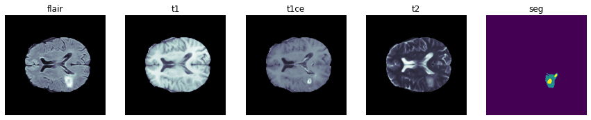
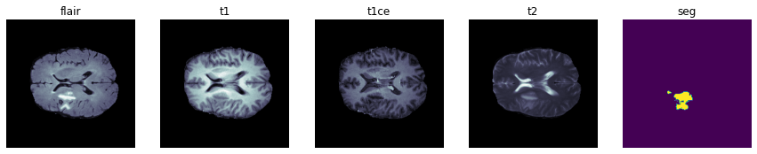
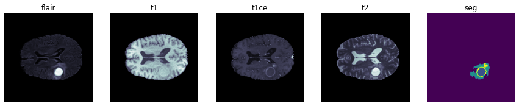
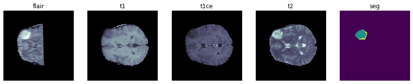

# Semantic segmentation of gliomas in pre-operative MRI scans.

## Problem definiton

Each MRI consists of 155 240 x 240 patches, in which each pixel is part of a tumor area:

The sub-regions of tumor considered for evaluation are: 
0. The background,
1. the necrotic and non-enhancing tumor core (NCR/NET)
2. the peritumoral edema (ED), 
3. the GD-enhancing tumor (ET),

According to the [dataset description](https://www.med.upenn.edu/cbica/brats2020/data.html) the multimodel scans are available as NIfTI files (.nii.gz) and describe 
* a) native (T1)
* b) post-contrast T1-weighted (T1Gd)
* c) T2-weighted (T2), 
* d) T2 Fluid Attenuated Inversion Recovery (T2-FLAIR) volumes.

These were acquired with different clinical protocols and various scanners from multiple (19) institutions.
The provided data are distributed after their pre-processing, i.e., co-registered to the same anatomical template, interpolated to the same resolution (1 mm^3) and skull-stripped.


## Libraries and data read


```python
# helper scripts
import config
import utils
import engine

import pandas as pd
import numpy as np
import matplotlib.pyplot as plt
import os
import segmentation_models_pytorch as smp
import torch
from torch_lr_finder import LRFinder
import nibabel as nib

# Make logfile to flush prints
import sys
old_stdout = sys.stdout # keep reference to existing stdout
sys.stdout = open(config.LOG_FILE, 'w')
```


```python
df = utils.collectMetadata()
```

We have a lot of empty patches (these are usually the first few and last few patches on an MRI that are completely empty), and a lot of patches containing only background (i.e. a brain slice with the background label only).


```python
for figNo in range(4):
    
    samplePaths = df[['flairPath', 't1Path', 't1cePath', 't2Path', 'labelPath']].sample(n = 1, random_state = figNo + 44).values[0]

    fig, ax = plt.subplots(nrows = 1, ncols = 5, figsize = (15, 5))
    for idx, pth in enumerate(samplePaths):

        x = np.asarray(nib.load(pth).dataobj)
        H, W, D = x.shape
        ax[idx].imshow(x[:, :, D // 2], cmap = 'bone')
        title = pth.split('/')[-1].split('_')[-1].split('.')[0]
        ax[idx].set_title(title)
        ax[idx].axis('off')

```






flair and t2 files seem to provide information regarding the different labels. t1, t1ce will not be used

## Data split and subsampling


```python
lvIdx, tIdx = utils.GroupTrainTestSplit(df['subjectID'], 
                                        testRatio = config.TEST_RATIO, 
                                        seedNo    = 15)

lIdx, vIdx  = utils.GroupTrainTestSplit(df['subjectID'].loc[lvIdx], 
                                        testRatio = config.VAL_RATIO, 
                                        seedNo    = 17)

traindf, valdf, testdf = df.loc[lIdx], df.loc[vIdx], df.loc[tIdx]

traindf = utils.subsample(traindf, config.BACKGROUND_RATIO)
valdf   = utils.subsample(valdf,   config.BACKGROUND_RATIO)
```

## Training setup


```python
noTrainSamples, noValSamples = traindf.shape[0], valdf.shape[0]

trainTr, valTr = engine.makeTransforms(flairPaths = traindf['flairPath'].unique(),
                                       t2Paths    = traindf['t2Path'].unique(),
                                       transformationType = config.TRANSFORM_TYPE)

trainLoader = utils.makeDataloader(traindf, trainTr, shuffle = True)
valLoader   = utils.makeDataloader(valdf,   valTr,   shuffle = False)

model       = smp.Unet(encoder_name    = config.ENCODER_NAME,
                       encoder_weights = config.ENCODER_WEIGHTS,
                       in_channels     = config.ENCODER_IN_CHANNEL,
                       classes         = config.NO_CLASSES)

criterion   = smp.losses.FocalLoss(mode       = 'multiclass',
                                   alpha      = config.LOSS_ALPHA,
                                   gamma      = config.LOSS_GAMMA,
                                   normalized = config.LOSS_NORM)

optimizer   = torch.optim.Adam(model.parameters(), lr = config.LEARN_RATE)
scaler      = torch.cuda.amp.GradScaler()
scheduler   = torch.optim.lr_scheduler.ReduceLROnPlateau(optimizer, 'min', verbose = True,
                                                         factor   = config.SCHEDULER_FACTOR,
                                                         patience = config.SCHEDULER_PATIENCE)
```

### Main training loop


```python
model.to(config.DEVICE)

# Load from a checkpoint if exists
model, optimizer, scheduler, scaler, curEpoch, trainLoss, valLoss, bestValLoss = \
    utils.loadCheckpoint(model, optimizer, scheduler, scaler, config.LAST_CHECKPOINT)

for epoch in range(curEpoch, config.EPOCHS):
    
    # train 
    trainLoss   = engine.train(model, criterion, optimizer, scaler, trainLoader) / noTrainSamples
    
    # validate
    valLoss     = engine.validate(model, criterion, valLoader) / noValSamples
    
    # reduce LR
    if scheduler is not None: scheduler.step(valLoss)
        
    # Make checkpoint
    bestValLoss = utils.makeCheckpoint(epoch, model, optimizer, scheduler, scaler, trainLoss, valLoss, bestValLoss)
    
```

## Test set predictions


```python
# Make sure subjects and patches appear in sorted orded
testdf = testdf.sort_values(['subjectID', 'patch']).reset_index()

# Make dataloader
testLoader   = utils.makeDataloader(testdf, valTr, 
                                    batchSize = D, # One MRI is one batch
                                    shuffle   = False)

# Load model from best checkpoint
checkpoint = torch.load(config.BEST_CHECKPOINT, map_location=torch.device('cpu'))
model      = smp.Unet(encoder_name    = config.ENCODER_NAME,
                      encoder_weights = config.ENCODER_WEIGHTS,
                      in_channels     = config.ENCODER_IN_CHANNEL,
                      classes         = config.NO_CLASSES)

model.load_state_dict(checkpoint['model_state_dict']);
```


```python
# Predict on the test set
sys.stdout = old_stdout # print here
TP, FP, FN, TN = engine.predict(model, testLoader, batchSize = D, noSamples = testdf.shape[0])

for idx, className in enumerate(['Background', 'NCR/NET', 'ED', 'ET']):

    print(f'---------------------- {className} Class ----------------------')
    utils.computeMetrics(TP[:, idx], FP[:, idx], FN[:, idx], TN[:, idx])
    print()
```

---------------------- Background Class ----------------------

Image-wise macro-averaged Accuracy:	    0.998

Image-wise macro-averaged Precision:    0.998

Image-wise macro-averaged Recall:	    0.999

Image-wise macro-averaged Sensitivity:  0.999

Image-wise macro-averaged Specificity:  0.912

Image-wise macro-averaged F1 Score:	    0.999

Image-wise macro-averaged F2 Score:	    0.999

Image-wise macro-averaged IoU Score:    0.997

---------------------- NCR/NET Class ----------------------

Image-wise macro-averaged Accuracy:	    0.997

Image-wise macro-averaged Precision:	0.885

Image-wise macro-averaged Recall:	    0.880

Image-wise macro-averaged Sensitivity:	0.880

Image-wise macro-averaged Specificity:	0.998

Image-wise macro-averaged F1 Score:	    0.814

Image-wise macro-averaged F2 Score:	    0.823

Image-wise macro-averaged IoU Score:	0.791

---------------------- ED Class ----------------------

Image-wise macro-averaged Accuracy:	    0.996

Image-wise macro-averaged Precision:	0.859

Image-wise macro-averaged Recall:	    0.852

Image-wise macro-averaged Sensitivity:	0.852

Image-wise macro-averaged Specificity:	0.998

Image-wise macro-averaged F1 Score:	    0.801

Image-wise macro-averaged F2 Score:	    0.801

Image-wise macro-averaged IoU Score:	0.758

---------------------- ET Class ----------------------

Image-wise macro-averaged Accuracy:	    0.997

Image-wise macro-averaged Precision:	0.830

Image-wise macro-averaged Recall:	    0.848

Image-wise macro-averaged Sensitivity:	0.848

Image-wise macro-averaged Specificity:	0.999

Image-wise macro-averaged F1 Score:	    0.773

Image-wise macro-averaged F2 Score:	    0.771

Image-wise macro-averaged IoU Score:	0.750
    
